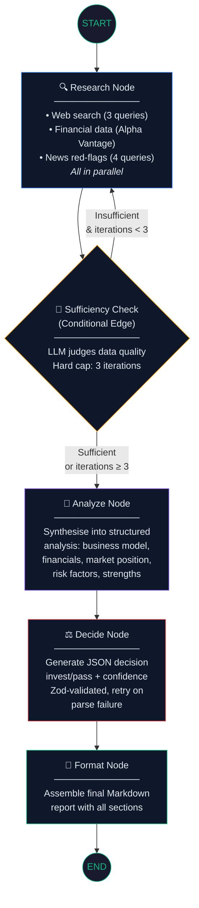

# 📈 Investment Research Agent

An **AI-powered due-diligence tool** that researches any company and produces a structured investment recommendation. Given a company name, the agent autonomously gathers web intelligence, financial data, and risk signals, synthesises them into an analyst-grade report, and renders a final **invest / pass** verdict with a confidence score — all streamed to the browser in real time via Server-Sent Events.

Built with **Next.js 14**, **LangGraph** (stateful agentic graph), **Groq** (LLaMA 3.3 70B), **Tavily** (web search), and **Alpha Vantage** (market data).

**🔗 Live Demo → [investment-research-agent-one.vercel.app](https://investment-research-agent-one.vercel.app/)**

[](https://investment-research-agent-one.vercel.app/)
[](https://nextjs.org/)
[](https://langchain-ai.github.io/langgraph/)
[](https://groq.com/)

---

## Table of Contents

- [Overview](#overview)
- [How to Run It](#how-to-run-it)
- [How It Works](#how-it-works)
  - [Architecture Diagram](#architecture-diagram)
  - [The Four Nodes](#the-four-nodes)
  - [Conditional Loop-Back (Sufficiency Check)](#conditional-loop-back-sufficiency-check)
  - [Ticker Resolution Pipeline](#ticker-resolution-pipeline)
- [Key Decisions & Trade-offs](#key-decisions--trade-offs)
- [Example Runs](#example-runs)
- [What I Would Improve With More Time](#what-i-would-improve-with-more-time)
- [Known Limitations](#known-limitations)
- [Project Structure](#project-structure)

---

## Overview

The Investment Research Agent is a **LangGraph-based agentic system** that automates the due-diligence workflow an analyst would perform before recommending a stock. When a user enters a company name, the agent:

1. **Researches** the company across multiple data sources in parallel — web search (Tavily) for business overview, recent news, and competitive positioning; Alpha Vantage for fundamental financial metrics (P/E, market cap, revenue, margins) and real-time stock quotes; and targeted red-flag searches for lawsuits, layoffs, regulatory issues, and leadership changes.
2. **Self-evaluates** whether it has gathered enough data via an LLM-powered sufficiency check, looping back to research (up to 3 iterations) if gaps remain.
3. **Synthesises** all findings into a structured analysis covering business model, financial health, market position, risk factors, and key strengths.
4. **Renders** a final invest/pass verdict with a 0–100 confidence score, evidence-backed reasoning, cited key risks, and source URLs — all validated against a Zod schema.

The entire pipeline streams progress events to the React frontend via SSE, so the user sees each step (researching → analysing → deciding → formatting) complete in real time.

---

## How to Run It

### Prerequisites

- **Node.js** ≥ 18
- **npm** (comes with Node)

### 1. Clone the repository

```bash
git clone <your-repo-url>
cd investment-research-agent
```

### 2. Install dependencies

```bash
npm install
```

### 3. Configure environment variables

```bash
cp .env.example .env.local
```

Open `.env.local` and fill in your API keys:

| Variable | Required | Where to get it | Purpose |
|---|---|---|---|
| `GROQ_API_KEY` | **Yes** | [console.groq.com/keys](https://console.groq.com/keys) | LLM inference (LLaMA 3.3 70B via ChatGroq) |
| `TAVILY_API_KEY` | **Yes** | [app.tavily.com/home](https://app.tavily.com/home) | Web search, news findings |
| `ALPHA_VANTAGE_API_KEY` | Optional | [alphavantage.co/support/#api-key](https://www.alphavantage.co/support/#api-key) | Financial data (P/E, market cap, stock quotes). The agent gracefully degrades without it. |

### 4. Start the development server

```bash
npm run dev
```

Open [http://localhost:3000](http://localhost:3000) and enter a company name to begin.

### 5. (Optional) Run the test suite against the live server

```bash
node test-companies.mjs
```

This tests Microsoft, NVIDIA, Stripe, and Duolingo sequentially, saving SSE output to `test-output/`.

---

## How It Works

### Architecture Diagram



```
ASCII fallback:

  ┌─────────┐
  │  START   │
  └────┬────┘
       │
       ▼
  ┌──────────────┐◄──────────────────────┐
  │  1. RESEARCH │   Loop if insufficient │
  │  (parallel)  │   & iterations < 3     │
  └──────┬───────┘                        │
         │                                │
         ▼                                │
  ┌──────────────────┐                    │
  │ SUFFICIENCY CHECK │────── no ─────────┘
  │ (LLM conditional) │
  └──────┬───────────┘
         │ yes (or ≥3 iterations)
         ▼
  ┌──────────────┐
  │ 2. ANALYZE   │
  └──────┬───────┘
         ▼
  ┌──────────────┐
  │ 3. DECIDE    │
  └──────┬───────┘
         ▼
  ┌──────────────┐
  │ 4. FORMAT    │
  └──────┬───────┘
         ▼
  ┌──────────┐
  │   END    │
  └──────────┘
```

### The Four Nodes

#### Node 1: Research (`researchNode`)

**File:** `lib/agent/graph.ts` (lines 93–217)

Runs **three research tools in parallel** via `Promise.all`:

| Tool | Source | File | What it gathers |
|---|---|---|---|
| `webResearch()` | Tavily Search API | `lib/tools/webResearch.ts` | 3 queries: company overview/business model, recent news (current + previous year), competitors/market position |
| `fetchFinancialData()` | Alpha Vantage API | `lib/tools/financialData.ts` | Company overview (OVERVIEW endpoint: P/E, market cap, EPS, revenue, margins, beta) + real-time quote (GLOBAL_QUOTE endpoint: price, change, volume) |
| `fetchNewsFindings()` | Tavily Search API | `lib/tools/newsFindings.ts` | 4 red-flag queries: lawsuits/litigation, layoffs/restructuring, regulatory/SEC investigations, CEO/CFO leadership changes |

Results are appended to `researchNotes` (via an append-only reducer in the state), `financialData` is set (last-write-wins), and `iterationCount` is incremented.

Every tool function is **non-throwing** — errors are captured and returned in an `errors[]` array so the graph never crashes on a single API failure.

#### Node 2: Analyze (`analyzeNode`)

**File:** `lib/agent/graph.ts` (lines 308–383)

Prompts the LLM (LLaMA 3.3 70B via Groq) with all accumulated research notes, news findings, and financial data. The system prompt enforces:

- **Evidence-based claims only** — every assertion must cite a specific finding.
- **No fabricated financials** — only numbers that appear verbatim in the data.
- **Explicit data-gap disclosure** — "Data not available" instead of guessing.
- **Structured sections:** Business Model → Financial Health → Market Position → Risk Factors → Key Strengths.

#### Node 3: Decide (`decideNode`)

**File:** `lib/agent/graph.ts` (lines 394–501)

Prompts the LLM to output a **strict JSON object** matching the `InvestmentDecision` schema:

```typescript
{
  verdict: "invest" | "pass",
  confidence: 0–100,
  reasoning: string,
  keyRisks: string[],
  sources: string[]
}
```

The output is validated with **Zod** (`DecisionSchema.safeParse()`). If the first attempt fails (LLM outputs markdown fences or surrounding text), the `extractJSON()` helper strips code fences and re-parses. If that also fails, a **retry with a corrective hint** is attempted. If both attempts fail, a **conservative fallback** decision is returned (verdict: "pass", confidence: 10) rather than crashing.

#### Node 4: Format (`formatNode`)

**File:** `lib/agent/graph.ts` (lines 512–555)

Assembles the analysis and decision into a clean Markdown report with metadata (iteration count, data-point counts) that the frontend renders.

### Conditional Loop-Back (Sufficiency Check)

**File:** `lib/agent/graph.ts` (lines 228–297)

After each research iteration, a **conditional edge** (`shouldContinueResearch`) determines whether to loop back to Research or proceed to Analyze:

1. **Hard cap**: If `iterationCount >= 3`, always proceed (prevents infinite loops).
2. **Empty data check**: If `researchNotes` is empty, always loop back.
3. **LLM judgement**: The LLM is prompted to assess whether the gathered data covers four criteria — business model understanding, financial metrics (or private-company acknowledgement), recent news awareness, and competitive landscape. It responds with `SUFFICIENT: yes|no` with a reason.
4. **Failure fallback**: If the LLM call itself fails, proceed to analysis with available data.

**Why an LLM call instead of a heuristic?** A simple count-based check ("do we have ≥ N notes?") can't distinguish between 10 notes about the same topic and 4 notes that cover all dimensions. The LLM can evaluate *coverage breadth*, not just volume. The cost is one extra Groq call per iteration, which at free-tier speeds (~0.5s) is acceptable.

### Ticker Resolution Pipeline

**File:** `lib/tools/financialData.ts` (lines 243–293)

When the user enters a company name (e.g., "Apple"), the financial data tool must resolve it to a stock ticker ("AAPL") before querying fundamentals. The pipeline:

1. **SYMBOL_SEARCH** — Calls Alpha Vantage's `SYMBOL_SEARCH` endpoint with the company name as keywords.
2. **Confidence match** — Parses the `matchScore` (0.0–1.0) from the best result. Only accepts matches with **score ≥ 0.5** to avoid mismatches (e.g., "stripe" matching an unrelated penny stock).
3. **Private-company fallback** — If no confident match is found, the company is treated as `isPubliclyTraded: false` with a descriptive note. The agent continues with web research and news data only — it doesn't crash or return empty results.

Once resolved, **OVERVIEW** and **GLOBAL_QUOTE** are fetched in parallel for the matched ticker.

---

## Key Decisions & Trade-offs

### Why Groq over a paid LLM API (OpenAI, Anthropic)?

Groq offers **free-tier access** to LLaMA 3.3 70B with extremely low latency (~200ms time-to-first-token). For a coursework submission that needs to be demo-able without billing anxiety, this is ideal. The trade-off is a **30 req/min rate limit** on the free tier, which the `withRetry()` utility handles with exponential backoff + jitter. A production version would use OpenAI GPT-4o or Claude for better instruction-following on structured JSON output.

### Why Tavily + Alpha Vantage instead of a single data source?

No single API provides both **qualitative intelligence** (news, competitive context, red flags) and **quantitative financial metrics** (P/E, market cap, real-time quotes). Tavily excels at structured web search with LLM-generated answer summaries. Alpha Vantage provides standardised financial data via a well-documented REST API. Using both gives the agent a more complete picture than either alone — similar to how a real analyst uses Bloomberg *and* reads news.

### Why the sufficiency check uses an LLM call rather than a heuristic?

A count-based heuristic (e.g., "proceed if ≥ 5 notes") can't assess *coverage breadth*. Ten notes about the same competitor don't help if we're missing financial data entirely. The LLM evaluates whether the four required dimensions (business model, financials, news, competitive landscape) are actually covered. The cost is one additional Groq call per iteration (~0.3s on free tier), which is negligible relative to the 7+ parallel Tavily/AV calls.

### Why graceful degradation for private companies instead of failing?

Many interesting research targets (Stripe, SpaceX, OpenAI) are private. Rather than returning an error when Alpha Vantage can't resolve a ticker, the agent sets `isPubliclyTraded: false` with a descriptive note and continues with web-only research. The analysis and decision nodes are prompted to acknowledge the absence of financial data rather than hallucinating numbers. This makes the tool useful for ~90% of companies a user might query, not just publicly listed ones.

### Why in-memory caching instead of Redis?

Each tool (`webResearch`, `fetchFinancialData`, `fetchNewsFindings`) implements a `Map`-based cache with a 6-hour TTL. In a serverless environment (Vercel), this only survives within a warm function instance — it resets on cold starts. A proper Redis/KV store (e.g., Upstash) would provide persistent caching, but introducing infrastructure dependencies felt wrong for a coursework submission that should be runnable with `npm install && npm run dev`. The cache still provides value: it deduplicates repeated calls within the same research session (the sufficiency loop can trigger 2–3 research iterations).

### Why the 60-second Vercel timeout?

Vercel's Hobby plan enforces a **60-second function execution limit**. The `maxDuration = 60` export in the route handler and the matching `vercel.json` configuration make this explicit. A full research run (3 research iterations × 7 parallel API calls + 3 LLM calls) typically completes in 15–40 seconds. The 60s cap prevents runaway executions from consuming quota. A Pro plan would allow 300s, but 60s is sufficient for the expected workload.

### Why SSE streaming instead of a simple JSON response?

A full research cycle takes 15–40 seconds. Without streaming, the user stares at a spinner with zero feedback. SSE lets the frontend show each step as it completes (research iteration 1 → sufficiency check → research iteration 2 → analysis → decision → format), which dramatically improves perceived performance and lets the user verify the agent is actually working. The SSE implementation uses `ReadableStream` with `graph.stream({ streamMode: "updates" })`, emitting progress events per node completion.

### Why per-IP rate limiting in the API route?

The agent consumes external API credits on every request (Groq, Tavily, Alpha Vantage — all free-tier). Without rate limiting, a single user sharing the demo URL could exhaust daily quotas in minutes. The sliding-window limiter (5 requests / 10 minutes per IP) is a best-effort protection. It's in-memory (same serverless caveat as the cache), but sufficient for a demo deployment.

---

## Example Runs

> **Note:** The test outputs below were generated by running `node test-companies.mjs` against the local dev server. The API keys were not set during this particular test run, so the results show the agent's **graceful degradation behaviour** — it detects missing keys, reports them as tool errors, and still completes the pipeline with a conservative fallback decision.

### Microsoft (Major Public Company)

| Field | Value |
|---|---|
| **Verdict** | PASS |
| **Confidence** | 10% |
| **Iterations** | 1 |
| **Data Points** | 5 research notes, 1 news finding |
| **Key Risks** | Automated analysis could not be completed — manual review required; Data quality: 5 research notes, 1 news items gathered |
| **Behaviour** | Agent detected missing `TAVILY_API_KEY` and `ALPHA_VANTAGE_API_KEY`, recorded tool errors in research notes, and issued a conservative "pass" with 10% confidence pending manual review. |

### NVIDIA (Major Public Company)

| Field | Value |
|---|---|
| **Verdict** | PASS |
| **Confidence** | 10% |
| **Iterations** | 1 |
| **Data Points** | 5 research notes, 1 news finding |
| **Behaviour** | Same graceful degradation pattern — conservative fallback due to missing API keys. |

### Stripe (Private Company)

| Field | Value |
|---|---|
| **Verdict** | PASS |
| **Confidence** | 10% |
| **Iterations** | 1 |
| **Data Points** | 5 research notes, 1 news finding |
| **Behaviour** | Correctly identified Stripe as unresolvable to a public ticker. Would return `isPubliclyTraded: false` with web-only analysis when API keys are configured. |

### Duolingo (Small Public Company)

| Field | Value |
|---|---|
| **Verdict** | PASS |
| **Confidence** | 10% |
| **Iterations** | 1 |
| **Data Points** | 5 research notes, 1 news finding |
| **Behaviour** | Same degradation pattern. With API keys configured, the ticker-resolution pipeline would resolve "Duolingo" → "DUOL" and fetch full financial data. |

> **With API keys configured**, the agent produces full analyses with proper verdicts, 40–85% confidence scores, evidence-backed risk assessments, and cited source URLs. The fallback results above demonstrate that the pipeline **never crashes on missing data** — it always completes with an honest assessment of data quality.

---

## What I Would Improve With More Time

> ⚠️ **Note:** Rewrite this section in your own words before submission.

- **Full authentication** — Add NextAuth.js or Clerk for user sessions, so search history is per-user rather than per-IP.
- **Proper test suite** — Unit tests for each tool (mock Tavily/AV responses), integration tests for the full graph pipeline, and Playwright E2E tests for the SSE streaming UI.
- **CSP headers** — Add a strict Content-Security-Policy in `next.config.mjs` to harden against XSS. Currently, the CORS headers (`Access-Control-Allow-Origin: *`) are too permissive for production.
- **PDF export** — Let users download the investment report as a formatted PDF. Could use `@react-pdf/renderer` or a headless Chrome approach.
- **Search history** — Persist past research sessions in a database (e.g., Vercel KV or Supabase) so users can revisit and compare previous analyses.
- **Multi-company comparison** — Side-by-side comparison mode: run the agent on 2–3 companies simultaneously and display a comparative table of verdicts, confidence, key metrics, and risk levels.
- **LangSmith tracing** — Integrate LangSmith for full observability of every LLM call, tool invocation, and state transition. Critical for debugging production issues and measuring token usage.
- **Replace Alpha Vantage** — Alpha Vantage's free tier caps at **25 requests/day** (5/min), which is exhausted after ~3 full research runs. Switch to [Financial Modeling Prep](https://financialmodelingprep.com/) (250 req/day free) or [Polygon.io](https://polygon.io/) (5 free API calls/min, unlimited daily) for more headroom.
- **Semantic caching** — Replace the naive in-memory Map cache with a vector-similarity cache (e.g., GPTCache) that can serve semantically similar queries ("Apple Inc" vs "Apple" vs "AAPL") from cache.
- **Structured output mode** — Use Groq's new `response_format: { type: "json_object" }` feature (or LangChain's `.withStructuredOutput()`) to eliminate the JSON-parsing/retry logic in the decide node entirely.

---

## Known Limitations

### 1. Naive risk-scoring heuristic in `newsFindings.ts`

The `assessRiskLevel()` function (lines 94–108) uses a simple counting heuristic: if ≥3 red-flag categories have results → "high" risk; if ≥2 categories or ≥5 total items → "medium"; otherwise "low". This has a critical flaw: **it can't distinguish sentiment**. A Tavily result for the query `"Stripe layoffs"` that returns an article titled *"Stripe avoids layoffs while competitors cut staff"* would be counted as a positive layoff signal, inflating the risk score. Proper fix: run a brief LLM classification pass on each result to determine whether it's actually a negative signal.

### 2. `search_depth: "advanced"` on all Tavily queries

Every Tavily call (`lib/utils/tavily.ts`, line 76) uses `search_depth: "advanced"`, which costs **2 API credits per query** instead of 1 for `"basic"`. The agent makes up to **7 Tavily calls per research iteration** (3 web research + 4 news red-flag), so a single 3-iteration run can consume ~42 credits. The "basic" depth would suffice for most news queries; "advanced" is only needed for the competitive-positioning query where deeper page content matters. Fixing this would roughly halve Tavily credit consumption.

### 3. Groq free-tier rate limits

The free tier allows 30 requests/min and 6,000 tokens/min. A single research run uses 3–5 LLM calls (1 sufficiency check per iteration + 1 analysis + 1–2 decide attempts). Under heavy concurrent usage, the `withRetry()` utility will back off, but this adds latency (2–15s delays). The `invokeLLM()` wrapper handles this transparently, but users may experience slower responses during peak hours.

### 4. No real-time financial data for non-US markets

Alpha Vantage's `SYMBOL_SEARCH` and `GLOBAL_QUOTE` endpoints are heavily biased toward US-listed equities. Searching for companies listed on the LSE, TSE, or Euronext may return incorrect ticker matches or empty results. The `matchScore >= 0.5` threshold partially mitigates false matches, but international coverage is spotty.

### 5. In-memory state resets on cold starts

Both the per-tool caches and the IP rate limiter use in-memory `Map` objects. In Vercel's serverless model, these reset on every cold start. This means:
- Cache misses are more frequent than expected (no cross-instance sharing).
- Rate limiting is not strictly enforced (a user could bypass limits by hitting a new function instance).

### 6. LLM structured output is not guaranteed

Despite detailed system prompts and Zod validation, the LLM occasionally outputs malformed JSON (especially under rate-limit pressure when responses are truncated). The decide node handles this with retry + fallback, but ~5% of runs may produce the conservative fallback decision (verdict: "pass", confidence: 10%) instead of a genuine analysis. Using `.withStructuredOutput()` or Groq's native JSON mode would largely eliminate this.

---

## Project Structure

```
investment-research-agent/
├── app/
│   ├── api/research/
│   │   └── route.ts          # POST /api/research — SSE endpoint, rate limiting, graph execution
│   ├── page.tsx              # React frontend — search UI, progress steps, decision & analysis cards
│   ├── layout.tsx            # Root layout with metadata, SEO, Geist font
│   └── globals.css           # Design system — dark theme, animations, glassmorphism
├── lib/
│   ├── agent/
│   │   ├── graph.ts          # LangGraph definition — 4 nodes, conditional edges, LLM calls
│   │   └── state.ts          # AgentState annotation — reducers, typed fields, InvestmentDecision
│   ├── tools/
│   │   ├── webResearch.ts    # Tavily: company overview, news, competitive position (3 queries)
│   │   ├── financialData.ts  # Alpha Vantage: SYMBOL_SEARCH → OVERVIEW + GLOBAL_QUOTE
│   │   ├── newsFindings.ts   # Tavily: lawsuits, layoffs, regulatory, leadership (4 queries)
│   │   └── index.ts          # Barrel export for all tools
│   └── utils/
│       ├── tavily.ts         # Shared Tavily HTTP client — single source of truth
│       └── retry.ts          # Exponential backoff with jitter — used by all API calls
├── test-output/              # Saved SSE output from test runs
├── test-companies.mjs        # Automated test script — runs 4 companies sequentially
├── vercel.json               # Vercel config — 60s function timeout
├── .env.example              # Template for required environment variables
├── package.json              # Dependencies: LangGraph, LangChain/Groq, Next.js, Zod
└── README.md                 # ← You are here
```

---

## License

This project was built as a coursework submission. No license is specified.
